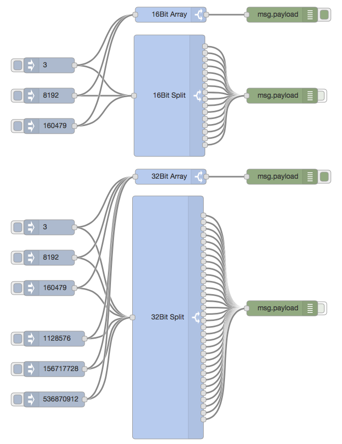

node-red-contrib-bit 
========================

## International Node-RED IIoT Website

For an international area, [Iniationware][4] has provided the [Node-RED PLUS International][5] website.

## Node-RED IIoT Webseite Deutschland

Für einen deutschsprachigen Bereich hat [Iniationware][4] die Webseite [Node-RED PLUS Germany][6] bereitgestellt.

## Contribution Information

[Node-RED][1] contribution package for Bit splitting

# Install

Run the following command in the root directory of your Node-RED install

    npm install node-red-contrib-bit

Run the following command for global install

    npm install -g node-red-contrib-bit

try these options on npm install to build, if you have problems to install

    --unsafe-perm --build-from-source

# What is it?

[Flow JSON][3]

# Debug

Debug will be activated by starting Node-RED with debug mode: 

    DEBUG=node_red_contrib_bit node-red -v

# Authors

[Klaus Landsdorf][2]

[1]:https://nodered.org
[2]:https://github.com/biancode
[3]:https://flows.nodered.org/flow/9015efb0c2251945da20da8ff55f123e
[4]:https://iniationware.com/
[5]:http://node-red.plus/
[6]:http://node-red-plus.de/
