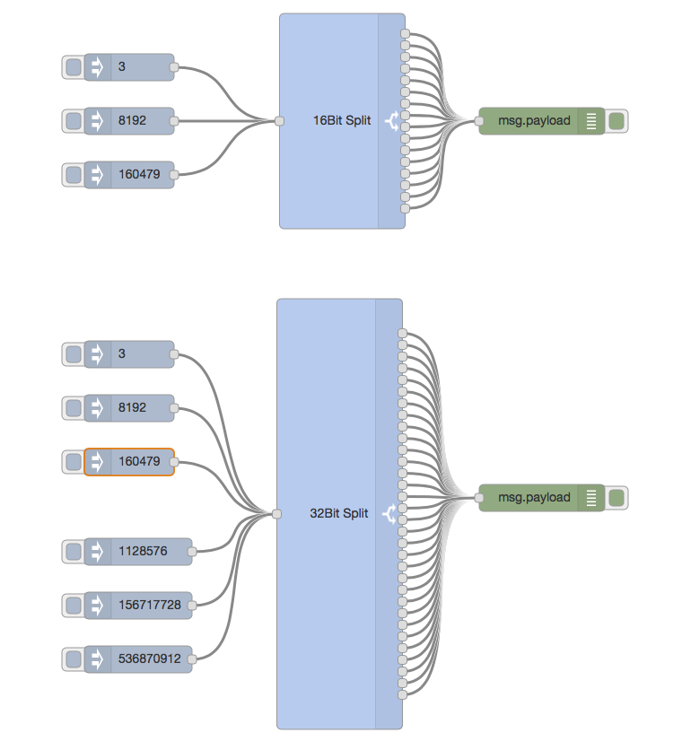

node-red-contrib-bit 
========================

[Node-RED][1] contribution package for Bit splitting

# Install

Run the following command in the root directory of your Node-RED install

    npm install node-red-contrib-bit

Run the following command for global install

    npm install -g node-red-contrib-bit

try these options on npm install to build, if you have problems to install

    --unsafe-perm --build-from-source

# What is it?

# Debug

Debug will be activated by starting Node-RED with debug mode: 

    DEBUG=node_red_contrib_bit node-red -v

# Authors

[Klaus Landsdorf][2]

[1]:https://nodered.org
[2]:https://github.com/biancode

